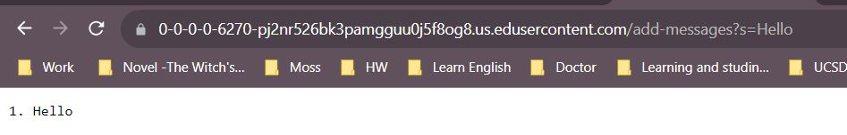
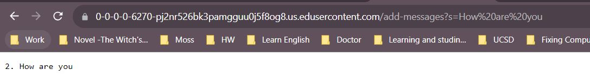
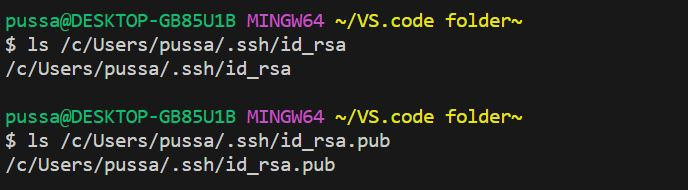
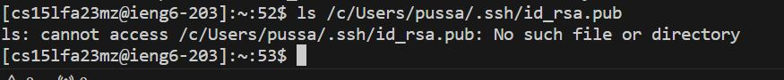
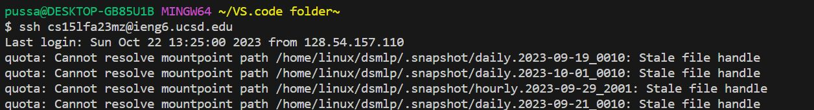

# Lab Report 2 - Servers and SSH Keys
## Part 1 "String Servers"

**StringServer.java**

``` bash
import java.io.IOException;
import java.net.URI;
import java.util.ArrayList;

class Handler3 implements URLHandler {
    // The one bit of state on the server: a number that will be manipulated by
    // various requests.
    ArrayList<String> s = new ArrayList<String>();
    int num = 0;

    public String handleRequest(URI url) {
        if (url.getPath().equals("/")) {
            return String.format("string: %s", s);
        }
        else {
            if (url.getPath().contains("/add-message")) { // decide the name of the function
                String[] parameters = url.getQuery().split("=");
                if (parameters[0].equals("s")) {
                    
                    String print = ""; // make new string called print
                    // For loop to replace + with space
                    for(int i = 0; i < parameters[1].length(); i++){
                        if(parameters[1].charAt(i) == '+'){ // replace '+' with space
                            print = print + " ";  
                        }
                        else {
                            print += parameters[1].charAt(i); // add the character from the input.
                        }
                        // print now will contains new string make up of the user input without '+' character.
                    }
                    
                    s.add(print); // Assume that parameters[1] is string
                    num += 1; // for the number in front of the string
                    return String.format("%d. %s", num, print);
                }
            }
            return "404 Error";
        }
    }
}

class StringServer {
    public static void main(String[] args) throws IOException {
        if(args.length == 0){
            System.out.println("Missing port number! Try any number between 1024 to 49151");
            return;
        }

        int port = Integer.parseInt(args[0]);

        Server.start(port, new Handler3()); // Change the name of the Handler to Handler 3.
    }
}
```
**Screenshot from the two messages**



* The method handleRequest is called
* The argument is URI url. The values are ArrayList<String> s, int num, URI url, String[] parameters, and String print.
* The values that change are the parameters that get string input from the user, String print that will contain new string make up of the user input without '+' character, ArrayList<String> s that will add the string in print into the array of string (in this case: "Hello"), and the num increase by 1.
---



* The method handleRequest is called
* The argument is URI url. The values are ArrayList<String> s, int num, URI url, String[] parameters, and String print.
* The values that change are the parameters that get string input from the user ("How are you"), String print that will contain a new string made up of the user input without '+' character, ArrayList<String> s that will add the string in print into the array of string (in this case: "How are you"), and the num increase by 1 (num = 2).
* 
---

## Part 2 "SSH key"



ls command just shows where the private and public key is in this computer

---



ls command cannot find the public key because the key is not in the remote computer

---



This shows log-in without a password. I believe this happens because the key is automatically input in, so I don't need to.

---

## Part 3 "What I have learned"

I have learned many things about Java language (code and method), server remote and private, and ssh key. I also learned about bug and how to debug them.
